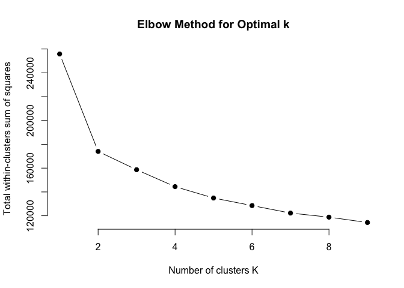
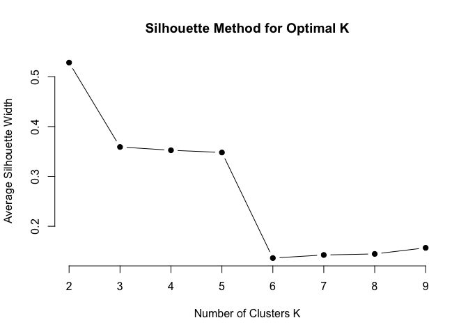
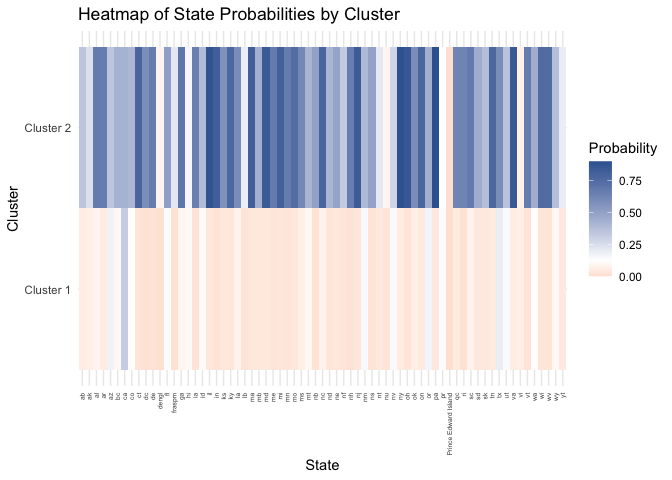

In this project, I use the k-means clustering algorithm in R to analyze
the [USDA’s Plants data
set](https://archive.ics.uci.edu/dataset/180/plants), uncovering
geographical structures of North America that are not immediately
apparent from the raw data. I generate visualizations of the clustering
results in R and Tableau. My analysis illustrates the relationship
between the distribution of the plants and the geography of the regions
in the data set.

The data set comprises 34,781 plant genera and species, each associated
with a list of regions where the plant is found. The dataset 
contains data from the 50 states in the United States, the Candian 
provinces, as well as other regions of North America. Each record 
contains the plant’s name along with the regions it inhabits, 
identified by abbreviations.

In this report, the words "state" and "region" are used interchangably 
in variable names and names of other items in the code, as well as in text
found in data visualizations.

### Loading and Transforming Data Into Presence-Absence Matrix

``` r
# Define the paths to the .names and .data files
data_file <- "/Users/arielseidman/Desktop/plants/plants.data"

# Read the raw data as a character vector
raw_data <- readLines(data_file)
raw_data <- iconv(raw_data, from = "UTF-8", to = "ASCII//TRANSLIT", sub = "")

# Below are the 69 unique region abbreviations in the data set
state_names <- c("al", "ak", "ar", "az", "ca", "co", "ct",
            "de", "dc", "fl", "ga", "hi", "id", "il", 
            "in", "ia", "ks", "ky", "la", "me", "md", 
            "ma", "mi", "mn", "ms", "mo", "mt", "ne", 
            "nv", "nh", "nj", "nm", "ny", "nc", "nd", 
            "oh", "ok", "or", "pa", "pr", "ri", "sc", 
            "sd", "tn", "tx", "ut", "vt", "va", "vi", 
            "wa", "wv", "wi", "wy", "ab", "bc", "mb", 
            "nb", "lb", "nf", "nt", "ns", "nu", "on", 
            "Prince Edward Island", "qc", "sk", "yt", "dengl", "fraspm")

# Initialize a matrix of zeros with 1 row per plant and 1 column per region
presence_matrix <- matrix(0, nrow = length(raw_data), ncol = length(state_names))

# Name the columns of the matrix using region names
colnames(presence_matrix) <- state_names

# Populate the matrix
for (i in 1:length(raw_data)) {
  # Split each line into the plant name and the list of regions
  elements <- unlist(strsplit(raw_data[i], ","))
  
  # Extract the region names (discard the first element which is the plant name)
  plant_states <- elements[-1]
  
  # Trim white space
  plant_states <- trimws(plant_states)
  
  # Filter out any regions that are not in the state_names list
  valid_states <- plant_states[plant_states %in% state_names]
  
  # Mark the corresponding columns with 1's
  presence_matrix[i, valid_states] <- 1
}
```

I will perform k-means clustering on the presence matrix. Before I can
use the k-means algorithm, I must determine how many clusters to use
(k).

### Elbow Method for Choosing Value of K

``` r
# Initialize an empty vector to store within-cluster sum of squares (WSS) for each k
wss <- numeric()

# Range of k values to consider
k_range <- 1:9

# Calculate WSS for each k
for (k in k_range) {
  kmeans_result <- kmeans(presence_matrix, centers = k, nstart = 25, iter.max = 100)
  wss[k] <- kmeans_result$tot.withinss
}

# Plot WSS against the number of clusters
plot(k_range, wss, type = "b", pch = 19, frame = FALSE,
     xlab = "Number of clusters K",
     ylab = "Total within-clusters sum of squares",
     main = "Elbow Method for Optimal k")
```



The Elbow Method plot shows somewhat of a sharp bend at k=2. I will
compare the results of the Elbow Method with results from the Silhouette
Method.

### Silhouette Method for Choosing Value of K

``` r
library(cluster)

# Sample a subset of the presence matrix to reduce data size

# (In order to keep the session from crashing, I am using a subset of the matrix instead
# of the full matrix)

# The subset is likely to be reasonably representative enough of the full matrix for
# evaluating general clustering trends due to the use of random sampling

set.seed(123)  # Set seed for reproducibility
sample_size <- 5000  
sampled_data <- presence_matrix[sample(nrow(presence_matrix), sample_size), ]

# Initialize an empty vector to store average silhouette width for each k
k_range <- 2:9
sil_width <- numeric(length(k_range))

# Exclude k=1 from the range because silhouette width is undefined for k = 1 since
# silhouette analysis requires at least 2 clusters to compare

# Calculate silhouette width for each k
for (i in 1:length(k_range)) {
  k <- k_range[i]
  kmeans_result <- kmeans(sampled_data, centers = k, nstart = 25)
  sil <- silhouette(kmeans_result$cluster, dist(sampled_data))
  sil_width[i] <- mean(sil[, 3])
}

# Plot silhouette width against the number of clusters
plot(k_range, sil_width, type = "b", pch = 19, frame = FALSE,
     xlab = "Number of Clusters K",
     ylab = "Average Silhouette Width",
     main = "Silhouette Method for Optimal K")
```



``` r
optimal_k <- k_range[which.max(sil_width)]
cat("Optimal number of clusters:", optimal_k, "\n")
```

    ## Optimal number of clusters: 2

Based on my findings from the Elbow Method plot and the Silhouette
Method plot, I will use a k value of 2.

### Performing K-Means Clustering

In our case, each point in the 69-dimensional space represents one
plant. K-means clustering assigns each point to the cluster that has the
center closest to that point. The cluster centers are then updated based
on the new assignment by averaging the positions of all the points in
that cluster

``` r
set.seed(123)  # Set seed for reproducibility

# Perform k-means clustering with k = 2
kmeans_result <- kmeans(presence_matrix, centers = 2, nstart = 25, iter.max = 100)
```

### Performing Principal Component Analysis (PCA)

PCA is a dimensionality reduction technique that transforms the data
into a new set of uncorrelated variables called principal components
(PCs). These components capture the maximum variance in the data. In
order to visualize the clustering results in 2D, I use PCA to reduce
number of dimensions from 69 (there are 69 regions, and there is 1
dimension per region) to 2.

``` r
# Identify columns with zero variance
zero_variance_cols <- apply(presence_matrix, 2, var) == 0

# Zero-variance columns are columns where all the values are the same (either all 0s or 
# all 1s)

# Such columns do not contribute to distinguishing between different clusters

# Remove these columns from the matrix
filtered_matrix <- presence_matrix[, !zero_variance_cols]

# Print the number of columns removed
cat("Number of zero-variance columns removed:", sum(zero_variance_cols), "\n")
```

    ## Number of zero-variance columns removed: 1

``` r
# Perform k-means clustering with k = 2
set.seed(123)
kmeans_result <- kmeans(filtered_matrix, centers = 2, nstart = 25, iter.max = 100)

# Perform PCA on the filtered matrix
pca_result <- prcomp(filtered_matrix, scale. = TRUE)

# Create a data frame with PCA results and cluster assignments
pca_data <- data.frame(pca_result$x[, 1:2], Cluster = as.factor(kmeans_result$cluster))

# Plot the PCA results
library(ggplot2)
ggplot(pca_data, aes(x = PC1, y = PC2, color = Cluster)) +
  geom_point(size = 2) +
  scale_color_manual(values = c("#BC43AD", "#43BC52")) +  
  labs(title = "K-Means Clustering with k = 2 (PCA Visualization)",
       x = "Principal Component 1",
       y = "Principal Component 2") +
  theme_minimal()
```


The plot indicates that the data set does not contain two clearly
distinct clusters, as it looks more like a single group of points
split into two parts rather than two isolated groups.

### Probability Matrix

In this k-means clustering, we have a vector in 69-dimensional space for
each cluster. Each element/dimension of a vector corresponds to one of
the 69 regions. Each element of the vector can be interpreted as the
probability that a randomly selected plant from that cluster is found in
the corresponding region. I will create a probability matrix that
shows all of the information that the vectors contain; the matrix will
show one probability value per region per cluster. The purpose of
creating the matrix from the vectors is to put the information from the
vectors in a format that is more suitable for building visualizations.

``` r
# Load required libraries
library(ggplot2)
library(tidyr)
library(dplyr)
```

    ## 
    ## Attaching package: 'dplyr'

    ## The following objects are masked from 'package:stats':
    ## 
    ##     filter, lag

    ## The following objects are masked from 'package:base':
    ## 
    ##     intersect, setdiff, setequal, union

``` r
# Perform k-means clustering with k = 2
set.seed(123)
kmeans_result <- kmeans(presence_matrix, centers = 2, nstart = 25, iter.max = 100)

# Extract the cluster assignments from kmeans_result
cluster_assignments <- kmeans_result$cluster

# Number of clusters and regions
num_clusters <- 2
num_states <- ncol(presence_matrix)

# Initialize a matrix to store probabilities (clusters x regions)
prob_matrix <- matrix(0, nrow = num_clusters, ncol = num_states)
colnames(prob_matrix) <- colnames(presence_matrix)
rownames(prob_matrix) <- paste("Cluster", 1:num_clusters)

# Calculate the probability of each region having a "1" in each cluster
for (cluster in 1:num_clusters) {
  # Get the rows of the presence_matrix corresponding to the current cluster
  cluster_rows <- presence_matrix[cluster_assignments == cluster, ]
  
  # Calculate the probability of each region having a "1" in the current cluster
  prob_matrix[cluster, ] <- colMeans(cluster_rows)
}

# Calculate the overall average probability across all clusters and regions
average_probability <- mean(presence_matrix)

# Output the result
cat("The average probability across the entire dataset is:", average_probability, "\n")
```

    ## The average probability across the entire dataset is: 0.1248858

### Heat Map

I will create a heat map to visualize the probability matrix.

``` r
# Load required libraries
library(ggplot2)
library(tidyr)
library(dplyr)

# Convert the matrix to a data frame and reshape it for ggplot2
prob_df <- as.data.frame(prob_matrix) %>%
  mutate(Cluster = rownames(prob_matrix)) %>%
  pivot_longer(cols = -Cluster, names_to = "State", values_to = "Probability")

# Create a color scale where white represents the average probability,
# blue represents above average, and orange represents below average
color_scale <- scale_fill_gradient2(
  low = "#D26217",     # Below average
  mid = "white",       # Average
  high = "#3865A0",    # Above average
  midpoint = average_probability, # Set the midpoint to the average probability
  name = "Probability"
)

# Plot the heat map using ggplot2
ggplot(prob_df, aes(x = State, y = Cluster, fill = Probability)) +
  geom_tile() +
  color_scale +
  labs(
    title = "Heatmap of State Probabilities by Cluster",
    x = "State",
    y = "Cluster"
  ) +
  theme_minimal() +
  theme(
    axis.text.x = element_text(angle = 90, vjust = 0.5, hjust = 1, size = 5),  
    axis.text.y = element_text(angle = 0)
  )
```

 

The heat map illustrates how clustering reveals the geographic structure of
the regions; the closer two regions are to each other geographically, the
more similar their colors/probabilities are. To better visualize the
relationship between the proximity of regions and their respective
colors, let’s view the same information in the form of two choropleth
maps (one map for each cluster).

### Using Choropleth Maps for Plants Data Set

Each vector in 69-dimensional space corresponds to a cluster. Each
element of the vector corresponds to one of the 69 regions. The value of
each element is the probability that a plant chosen from that cluster at
random is from that region.

We can represent each cluster with a choropleth map by coloring each
region on the map according to that region’s probability value.

### Transforming Probability Matrix for Choropleth Maps

``` r
# Load necessary libraries
library(tidyr)
library(dplyr)

# Convert the probability matrix into a data frame
prob_df <- as.data.frame(prob_matrix)

# Add cluster names as a column
prob_df$Cluster <- rownames(prob_matrix)

# Define a vector that maps each region to its respective country
country_mapping <- c(
  "ab" = "Canada", "bc" = "Canada", "mb" = "Canada", "nb" = "Canada", "lb" = "Canada",
  "nf" = "Canada", "nt" = "Canada", "ns" = "Canada", "nu" = "Canada", "on" = "Canada",
  "Prince Edward Island" = "Canada", "qc" = "Canada", "sk" = "Canada", "yt" = "Canada",
  "dengl" = "Denmark", "fraspm" = "France"
)

# Default all regions to "United States" first
state_countries <- rep("United States", ncol(prob_df) - 1)
names(state_countries) <- colnames(prob_df)[-ncol(prob_df)]

# Overwrite specific regions with their mapped countries
state_countries[names(country_mapping)] <- country_mapping

# Reshape the data into long format for Tableau
tableau_data <- prob_df %>%
  gather(key = "State", value = "Probability", -Cluster) %>%
  mutate(Country = state_countries[State])

# Save the reshaped data as a CSV file for Tableau
write.csv(tableau_data, "/Users/arielseidman/Desktop/plants/tableau_data.csv",
          row.names = FALSE)
```


### Results

White on the maps represents the average probability of a random plant
being found in a random region, which is about 0.1248858.

The choropleth maps show white areas connecting blue and orange areas. This color gradient appears because plant distributions
typically change gradually over large geographic areas.

The color transitions are not perfect gradients. Since the data set 
mostly categorizes plant data by state or province, the colors mostly
vary state-by-state, or province-by-province, etc. If we had location
data that is more specific than states and provinces (for example, 
plant data by county), the color transitions would be smoother. 
However, even with this state-level and province-level data, 
neighboring states/provinces still tend to have similar colors.

The color of each region represents the likelihood that a randomly
selected plant from that cluster is from that region. If a 
region is blue, plants from that cluster are more likely to be
found there than plants on average. Conversely, if a region is 
orange, plants in that cluster are less likely to be found there.

Cluster 1 is mostly orange with some blue in the West and Southwest
United States, while Cluster 2 is mostly blue with some orange in
Nunavut. This suggests that plants in Cluster 1 are more concentrated in
the West and Southwest United States than in other areas, while plants
in Cluster 2 are less concentrated in Nunavut than in other areas.

The k-means algorithm partially uncovers the geographic relationships
between the regions: although the data set lacks information about which
regions border each other, this information is revealed by the plant
distributions across regions and the clusters identified by k-means.

The main takeaway is that experimentation is important for finding the
most suitable visual representation of a data set to uncover patterns
and trends.
